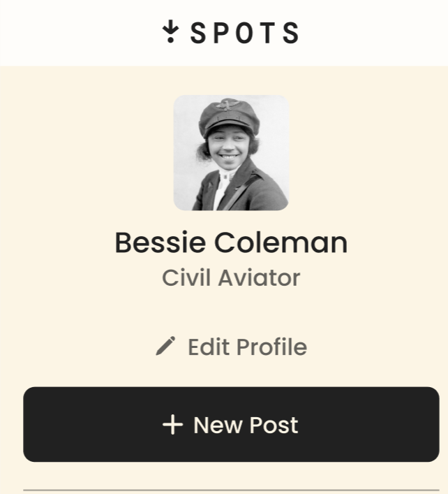
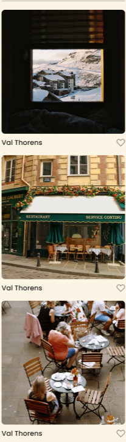

# se_project_spots

## description

This project is a website app designed to help users to share their pictues by posting them on their profile.
Upon opening the website, the user will see his own profile with ability of adding new post to its own gallery or editing profile picture without forgetting same functionalities are provided on the mobile with diffrent display methode to make the content visual,smooth and clear and accessible throught multiple devices.

## tech stack

- HTML

- CSS

- Responsive Design (Desktop , Mobile)

- Figma

  used to design the layout and visual elements of a website or app, including buttons, icons, typography, and colors.

  picture below shows desktop display :

  

  picture below shows how profile layout change from desktop display to mobile display

  

  picture below shows how gallery layout change from desktop display to mobile display

  

  the picture below shows user profile from where he is able to add new post and edit its own profile picture

    

## Deployment

This page is deployed to Github Pages

- https://amirguidoum.github.io/se_project_spots/

## Link Video

- https://drive.google.com/file/d/1NxNGyR7VAUeudo6naz4qSTeLq8APM68O/view?usp=sharing
